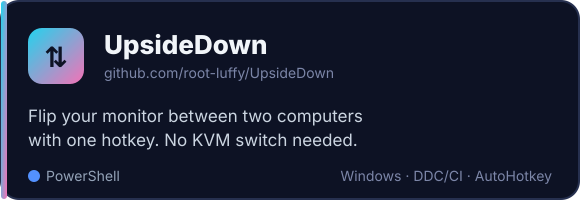
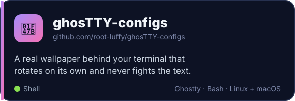
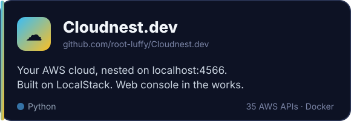

  

  
  
  

### ⚓ About me

- 🛠️ I build small, sharp tools for the friction I hit every day, then open-source them.
- 🔐 Right now: **AgentGate**, a Rust gateway that decides which AI agent may call which MCP tool.
- 🦀 Learning more Rust, and poking at Bitcoin, cryptography and wallets on the side.
- 🖥️ Terminal ricer. My Ghostty setup has its own repo.
- 📍 Based somewhere in the Milky Way.

### 🧭 Featured projects

  
  
  
  

### 🛠️ Tech I sail with

  
  
  
  
  
  
  
  
  
  
  

### 🏴‍☠️ Philosophy

> If I do it twice by hand, it becomes a tool. 
> If the tool is useful, it becomes a repo. 
> If the repo is useful, it gets a banner. 🙂

<code>root@luffy:~$ exit</code>

